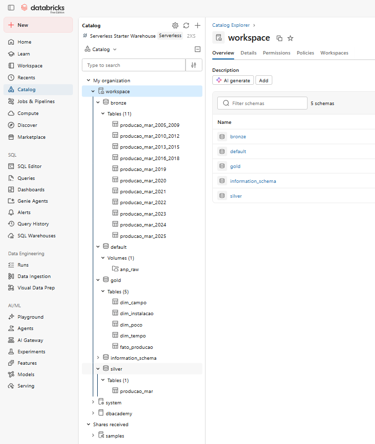

# Engenharia de Dados Aplicada à Produção Offshore de Petróleo e Gás Natural no Brasil: construção de um Lakehouse para análise da evolução e concentração da produção entre 2005 e 2025

**Disciplina:** Engenharia de Dados    
**Aluna:** Renata Rocha de Negreiros Alcântara   
**Matrícula:** 4052026000390  
**Data:** 27/10/2026

Projeto desenvolvido para a disciplina de **Engenharia de Dados**, com o objetivo de construir um pipeline de dados em ambiente cloud para analisar a evolução e a concentração da produção offshore de petróleo e gás natural no Brasil entre **2005 e 2025**.

A solução foi desenvolvida no **Databricks**, seguindo uma arquitetura Lakehouse organizada segundo o padrão Medallion, com camadas **Bronze, Silver e Gold** e persistência das tabelas em formato Delta.

---

## 1. Contexto de negócio e objetivo

O projeto utiliza dados públicos da **Agência Nacional do Petróleo, Gás Natural e Biocombustíveis (ANP)** referentes à produção de petróleo e gás natural por poço.

A análise considera o período entre janeiro de 2005 e dezembro de 2025, abrangendo **21 anos e 252 meses**, e busca responder às seguintes perguntas de negócio:

1. Como evoluiu a produção offshore brasileira de petróleo e gás natural entre 2005 e 2025?
2. Quais estados e bacias sedimentares concentram a maior parte da produção offshore?
3. Quais campos são responsáveis pela maior parcela da produção offshore brasileira?
4. A produção offshore brasileira está se tornando mais ou menos concentrada em poucos campos ao longo do tempo?

O contexto de negócio, as fontes utilizadas e a exploração inicial dos arquivos estão detalhados no **[Notebook 01 — Apresentação e Exploração dos Dados](notebooks/01_apresentacao_exploracao_dados.ipynb)**.

---

## 2. Arquitetura do projeto

O projeto foi desenvolvido no **Databricks Free Edition**, utilizando uma arquitetura Lakehouse estruturada segundo o padrão Medallion:

- **RAW:** preservação dos arquivos CSV originais disponibilizados pela ANP;
- **Bronze:** ingestão e persistência dos dados históricos em tabelas Delta;
- **Silver:** padronização, tratamento e consolidação do histórico;
- **Gold:** construção do modelo dimensional utilizado nas análises.

O fluxo geral do projeto pode ser representado por:

`ANP → RAW → Bronze → Silver → Gold → Análises`

A implementação utiliza o catálogo `workspace`, com schemas específicos para as camadas `bronze`, `silver` e `gold`.

### Evidência da implementação no Databricks

A imagem abaixo apresenta a organização do projeto no catálogo do Databricks, incluindo a área RAW e as tabelas persistidas nas diferentes camadas da arquitetura.

Os procedimentos de construção, transformação e persistência das tabelas estão documentados nos respectivos notebooks do projeto.

---

## 3. Guia de navegação dos notebooks

Os notebooks constituem a documentação principal do projeto e foram organizados de acordo com as etapas de desenvolvimento do pipeline.

| Notebook | Conteúdo |
|---|---|
| [01 — Apresentação e Exploração dos Dados](notebooks/01_apresentacao_exploracao_dados.ipynb) | Contexto de negócio, perguntas de negócio, fontes, coleta e exploração inicial dos arquivos |
| [02 — Ingestão Bronze](notebooks/02_ingestao_bronze.ipynb) | Ingestão dos dados históricos, tratamento das particularidades de leitura e construção da camada Bronze |
| [03 — Qualidade dos Dados](notebooks/03_qualidade_dados.ipynb) | Avaliação de estrutura, tipos, completude, duplicidades, granularidade e qualidade dos dados brutos |
| [04 — Transformação Silver](notebooks/04_transformacao_silver.ipynb) | Padronização, tratamento e consolidação dos dados históricos na camada Silver |
| [05 — Modelagem dos Dados](notebooks/05_modelagem_dados.ipynb) | Definição da granularidade e construção do modelo dimensional do projeto |
| [06 — Construção Gold](notebooks/06_construcao_gold.ipynb) | Construção, persistência e validação das dimensões e da tabela fato |
| [07 — Catálogo de Dados](notebooks/07_catalogo_dados.ipynb) | Documentação das tabelas, atributos, unidades de medida e linhagem dos dados |
| [08 — Análises das Perguntas de Negócio](notebooks/08_analises_perguntas_negocio.ipynb) | Construção das visualizações e análise das quatro perguntas de negócio |
| [09 — Autoavaliação](notebooks/09_autoavaliacao.ipynb) | Desafios, aprendizados, limitações e possibilidades de evolução do projeto |

> Recomenda-se a leitura dos notebooks na ordem numérica, pois cada etapa utiliza os resultados produzidos nas etapas anteriores.

---

## 4. Modelagem e catálogo de dados

A camada Gold foi estruturada segundo um **modelo dimensional em estrela**, composto pelas seguintes tabelas:

- `dim_tempo`
- `dim_campo`
- `dim_poco`
- `dim_instalacao`
- `fato_producao`

A definição da granularidade, o modelo dimensional e suas justificativas estão documentados no **[Notebook 05 — Modelagem dos Dados](notebooks/05_modelagem_dados.ipynb)**.

A construção e persistência das tabelas Gold estão disponíveis no **[Notebook 06 — Construção Gold](notebooks/06_construcao_gold.ipynb)**.

O catálogo detalhado dos atributos, tipos de dados, unidades de medida e linhagem está disponível no **[Notebook 07 — Catálogo de Dados](notebooks/07_catalogo_dados.ipynb)**.

---

## 5. Pipeline e qualidade dos dados

O pipeline contempla desde a ingestão dos arquivos históricos até a disponibilização das tabelas analíticas na camada Gold.

Durante o desenvolvimento foram avaliados aspectos como:

- estrutura dos arquivos históricos;
- tipos de dados;
- valores nulos;
- duplicidades;
- granularidade dos registros;
- cardinalidade dos atributos categóricos;
- problemas de parsing e codificação de caracteres;
- valores numéricos negativos.

Os dados originais são preservados na área RAW, enquanto as decisões de tratamento são documentadas antes de sua aplicação nas etapas seguintes do pipeline.

A análise de qualidade está detalhada no **[Notebook 03 — Qualidade dos Dados](notebooks/03_qualidade_dados.ipynb)** e as transformações correspondentes no **[Notebook 04 — Transformação Silver](notebooks/04_transformacao_silver.ipynb)**.

---

## 6. Análise de dados

As quatro perguntas de negócio são analisadas no **[Notebook 08 — Análises das Perguntas de Negócio](notebooks/08_analises_perguntas_negocio.ipynb)**.

As análises utilizam as tabelas da camada Gold para investigar:

1. a evolução da produção offshore de petróleo e gás natural entre 2005 e 2025;
2. a distribuição da produção entre estados e bacias sedimentares;
3. a participação dos principais campos produtores;
4. a evolução da concentração da produção em poucos campos.

O Notebook 08 reúne a preparação dos dados analíticos, as visualizações, a interpretação dos resultados e as fontes externas utilizadas para contextualização.

---

## 7. Fonte dos dados

A principal fonte utilizada foi o conjunto **Produção de Petróleo e Gás Natural por Poço**, disponibilizado pela Agência Nacional do Petróleo, Gás Natural e Biocombustíveis (ANP).

Os arquivos utilizados abrangem o período de **2005 a 2025** e foram obtidos diretamente da plataforma de Dados Abertos da ANP.

**Fonte principal:**  
[ANP — Produção de Petróleo e Gás Natural por Poço](https://www.gov.br/anp/pt-br/centrais-de-conteudo/dados-abertos/producao-de-petroleo-e-gas-natural-por-poco)

Os arquivos brutos não são reproduzidos neste repositório. Os notebooks documentam os procedimentos utilizados para ingestão, tratamento, modelagem e análise dos dados.

### Licença e condições de uso

Os dados utilizados neste projeto são disponibilizados publicamente pela ANP em sua seção de Dados Abertos.

A disponibilização está inserida na **Política de Dados Abertos do Poder Executivo Federal**, instituída pelo Decreto nº 8.777/2016, segundo a qual dados abertos podem ser livremente acessados, utilizados, modificados e compartilhados, observadas as condições aplicáveis de preservação da proveniência e abertura.

Os Termos de Uso do portal da ANP autorizam a reprodução total ou parcial de seu conteúdo, sem fins lucrativos, mediante citação clara e visível da fonte, preferencialmente acompanhada de link para o conteúdo original.

Neste projeto, os dados são utilizados exclusivamente para fins acadêmicos, mantendo a ANP explicitamente identificada como fonte dos dados.

**Referências:**

- [ANP — Dados Abertos](https://www.gov.br/anp/pt-br/centrais-de-conteudo/dados-abertos/dados-abertos)
- [ANP — Termos de Uso do Portal](https://www.gov.br/anp/pt-br/acesso-a-informacao/termos-de-uso-privacidade-e-seguranca-1/termos-uso-portal-anp)
- [Governo Digital — Política de Dados Abertos](https://www.gov.br/governodigital/pt-br/dados-abertos/dados-abertos/)

---

## 8. Tecnologias utilizadas

- Databricks Free Edition
- Apache Spark / PySpark
- Spark SQL
- Delta Lake
- Python
- Pandas
- Matplotlib
- GitHub

---

## 9. Autoavaliação

A avaliação crítica do desenvolvimento do projeto está documentada no **[Notebook 09 — Autoavaliação](notebooks/09_autoavaliacao.ipynb)**.

O notebook apresenta os principais desafios encontrados durante a construção do pipeline, os aprendizados obtidos, as limitações da solução atual e possíveis evoluções futuras.
